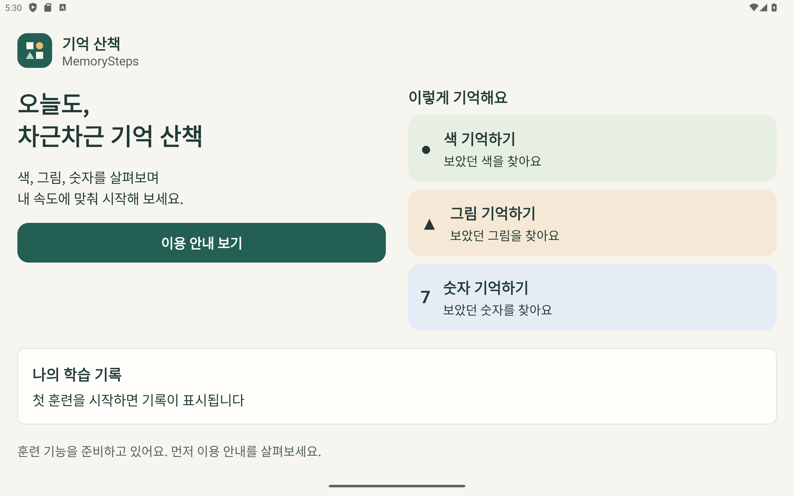
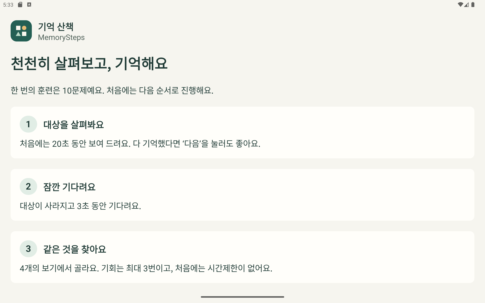
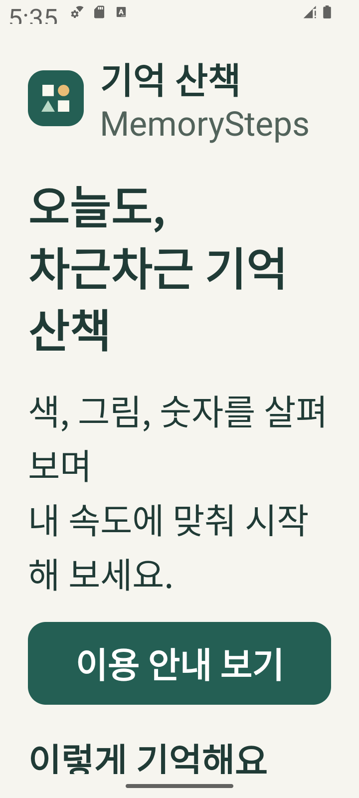

# 검증 보고서

## 2026-09-22 · 프로젝트 기본 실행 환경

대상: `feature/project-setup`. 이번 검증은 기본 홈·이용 안내·화면 이동에 한정됩니다.

### 환경

| 항목 | 실제 확인값 |
| --- | --- |
| 호스트 | Windows 11, Java Corretto 21.0.10 |
| 빌드 | Gradle 8.14.4, AGP 8.13.2, Kotlin 2.2.21, SDK 36, Build Tools 36.0.0 |
| 실제 실행 기기 | Android Emulator `Medium_Tablet`, Android 14 / API 34, x86_64 |
| 기본 화면 | 2560×1600px, 320dpi → 1280×800dp, 가로 |
| 작은 화면 검증 | 같은 AVD에 720×1600px 적용 → 360×800dp, 세로, font_scale=2.0 |
| 참고 설계 기기 | Galaxy Tab A9+ 11인치. **해당 실물 기기에서는 미실행** |

### 실행 결과

| 검증 | 결과 |
| --- | --- |
| `:app:assembleDebug` | 통과, 디버그 APK 생성 |
| `:app:assembleDebugAndroidTest` | 통과, 계측 테스트 APK 생성 |
| `:app:lintDebug` | 통과: **오류 0, 경고 8** |
| `:app:connectedDebugAndroidTest` | 태블릿 가로 화면에서 **2개 통과, 실패 0** |
| 작은 세로 화면·글자 200%·Wi-Fi/모바일 데이터 OFF에서 `am instrument -w` | 동일한 **2개 통과, 실패 0** |
| 실제 화면 캡처 검토 | 가로 홈, 안내, 작은 화면 큰 글자 홈 확인. 세로 스크롤과 줄바꿈으로 내용 접근 가능 |
| APK manifest 검사 | minSdk=26, targetSdk=36, MainActivity 실행 등록 확인. **INTERNET 권한 없음** |
| 의존성/라이선스 추출 | 직접·전이 98개 모듈, 미확인 라이선스 메타데이터 0개 |

계측 테스트는 아래 두 동작을 검증합니다.

1. 빈 기록 안내 확인 → 이용 안내 열기 → 세 번째 안내 내용까지 스크롤 → 홈 복귀 버튼으로 돌아오기.
2. 이용 안내에서 Activity 재생성 → 목적지 유지 → 시스템 뒤로 가기로 홈 돌아오기.

작은 화면·오프라인 조건은 새로운 검증 조건이므로 동일 테스트를 재실행했습니다. 검증 후 화면 크기와 글자·네트워크 설정을 복원했습니다.

### 경고와 해결한 문제

- Lint 경고 8개는 `OldTargetApi` 1개, `AndroidGradlePluginVersion` 2개, `GradleDependency` 3개, `NewerVersionAvailable` 2개입니다. 고정한 API 36 및 안정 의존성보다 새로운 버전이 있다는 권고입니다. 경고를 숨기거나 baseline으로 제외하지 않았습니다. 업그레이드는 별도 호환성 검증 후 진행합니다.
- 초기 검사에서 발견된 API 27 전용 navigation bar 테마 속성은 제거하고 Activity의 edge-to-edge 처리에 맡겼습니다.
- Android 12 이상에서는 cloud backup과 device transfer를 모두 제외하는 `dataExtractionRules`를 적용했습니다. 이전 버전은 `allowBackup=false`와 제외 규칙을 사용합니다.
- 로컬 SDK 경로의 Windows 드라이브 구분자 이스케이프를 수정했습니다. `local.properties`는 Git에서 제외합니다.
- 한글 경로의 Android 빌드를 위한 `android.overridePathCheck=true` 경고가 있습니다. 이 경로에서 실제 빌드·설치·실행은 통과했습니다.

### 재현 명령과 결과 위치

```powershell
.\gradlew.bat :app:assembleDebug :app:assembleDebugAndroidTest :app:lintDebug :app:connectedDebugAndroidTest --console=plain
.\gradlew.bat -I tools/dependency-inventory.init.gradle :app:dependencyInventory
pwsh -File tools/Write-DependencyInventory.ps1
```

- APK: `app/build/outputs/apk/debug/app-debug.apk`
- Lint: `app/build/reports/lint-results-debug.html`
- 계측 테스트: `app/build/reports/androidTests/connected/debug/index.html`
- 작은 화면·오프라인 실행 기록: 로컬 `.artifacts/small-largefont-offline-tests.txt` (`OK (2 tests)`)
- 디버그 APK SHA-256: `CE952C308CD6AA02B13D86D08B85A121D1C78BFED324B82DE1341AB367E55C46`

### 화면







### 아직 검증하지 않은 항목

- 실제 Galaxy Tab A9+ 및 다른 실물 태블릿.
- 최소 지원 API 26, target API 36의 실제 실행. 현재 실행 검증은 API 34입니다.
- 화면 회전 센서와 분할 화면 조작. 현재 크기 변경·Activity 재생성만 검증했습니다.
- TalkBack 조작과 시니어 대상 사용성 평가.
- 타이머·재시도·16개 선택지·게임 중 백그라운드 중단·저장/복구·난이도/밴딧 로직: 이번 PR에 미구현이므로 미실행.
- 출시 서명·릴리스 APK·최종 전체 오프라인 훈련: 출시 준비 PR에서 수행합니다.

## 2026-09-22 · 설계 문서 구체화

대상: `feature/game-spec`, 기준 `develop`의 PR #1 병합 커밋 `7ad0221`.

- 변경 범위: 난이도·AI 계약, 저장 키·트랜잭션·복구, 규칙 예제, 차분한 기록형 디자인, 종합 훈련 시작 경로와 순환 기준.
- 검토: 사용자 명세와 C 경계·반올림·P=15·복원 잔량·다음 묶음 보상·4/3/3 순환을 대조했습니다. 명세를 구체화한 판단은 DECISIONS.md에 기록했습니다.
- 문서 검사: `git diff --check` 통과, 로컬 Markdown 링크 18개 확인·누락 0개입니다.
- 앱 소스·리소스·의존성은 변경하지 않았으므로 이번 문서 PR에서 빌드와 기기 테스트를 재실행하지 않습니다. 위 첫 PR의 결과는 이전 코드에 대한 실행 기록입니다.
- RULE_EXAMPLES.md는 구현할 테스트의 입력·기대값입니다. **난이도·AI 로직 테스트가 통과했다는 뜻이 아닙니다.** 해당 엔진 PR에서 실제 테스트를 추가합니다.
- UI_DIRECTION.md는 선택한 디자인의 구현 기준이며, 이번 PR에서 화면 디자인이나 종합 훈련 플레이 기능을 완료했다고 보고하지 않습니다.

## 2026-09-23 · 게임 엔진

대상: `feature/game-engine`, 기준 develop의 PR #2 병합 커밋 `dd00acd`. Windows 11, Corretto 21.0.10, 기존 고정 Gradle/AGP/Kotlin/SDK에서 실행했습니다.

| 검증 | 결과 |
| --- | --- |
| `:app:testDebugUnitTest` | **38개 통과, 실패·건너뜀 0**: 생성 8, 모델 검증 7, 진행/판정 23 |
| 생성 조합 | 세 유형 × 다섯 보기 수 × 100시드 = 1,500개 문제에서 정답 하나·중복 없는 보기 확인 |
| `:app:assembleDebug` | 통과, 디버그 APK 생성 |
| `:app:lintDebug` | 통과: 오류 0, 기존 버전 권고 경고 8 |
| 의존성/라이선스 추출 | 앱 81·JVM 테스트 83·계측 테스트 82 외부 모듈, 중복 제거 98개·미확인 메타데이터 0 |

진행 테스트에는 1·2·3회차 정답, 세 번 오답, 중복 오답 무시, 첫 선택/누적 시간 분리, 무제한 풀이, 보기 렌더링 지연, 14,999ms 정답과 15,000ms 이상 시간 초과, 각 단계의 중단, 완료 결과 불변성, 읽기 전용 스냅샷을 포함했습니다. 가짜 단조 시계로 실제 대기 없이 경계를 검증합니다.

### 해결한 실행 환경 문제

첫 JVM 테스트 실행은 테스트 본문에 도달하지 못하고 클래스 세 개 모두 `ClassNotFoundException`으로 실패했습니다. 컴파일된 클래스는 존재했으며 Gradle의 테스트 인수 파일은 UTF-8, Java 실행기의 시스템 문자셋은 MS949였습니다. `file.encoding=COMPAT`로 인수 파일과 시스템 인코딩을 맞춘 뒤 38개가 통과했고, 해당 설정을 저장한 상태로 테스트·빌드·Lint를 다시 통과했습니다. [Gradle의 비 ASCII 경로 테스트 이슈](https://github.com/gradle/gradle/issues/30391)와 [JDK 인코딩 호환 옵션](https://docs.oracle.com/en/java/javase/21/migrate/preparing-migration.html)을 참고했습니다.

이 설정은 JDK 21에서 검증했습니다. OS 문자셋 자체가 폴더 이름을 표현하지 못하는 환경까지 검증한 것은 아닙니다. Java 소스는 UTF-8을 명시하고 Kotlin 소스도 UTF-8을 유지합니다.

### 재현

```powershell
.\gradlew.bat :app:testDebugUnitTest :app:assembleDebug :app:lintDebug --console=plain
.\gradlew.bat -I tools/dependency-inventory.init.gradle :app:dependencyInventory
pwsh -File tools/Write-DependencyInventory.ps1
```

- JVM 보고서: `app/build/reports/tests/testDebugUnitTest/index.html`
- Lint 보고서: `app/build/reports/lint-results-debug.html`
- APK: `app/build/outputs/apk/debug/app-debug.apk`
- 로컬 실행 기록: `.artifacts/game-engine-verification.log`

### 이번 범위에서 실행하지 않은 검증

UI·Android 생명주기 연결은 아직 없으므로 에뮬레이터의 게임 플레이·화면 표시 시점·백그라운드 복귀 테스트는 실행하지 않았습니다. 기존 홈/안내 UI는 변경하지 않아 계측 테스트도 재실행하지 않았습니다. 위 첫 PR의 기기 실행 결과는 과거 코드의 기록입니다. 실제 그림 렌더링, 색 구분 사용성, 16개 보기 접근성, 저장·프로세스 복구, 4/3/3 사이클, 난이도/밴딧 검증은 해당 후속 PR에 남습니다.
