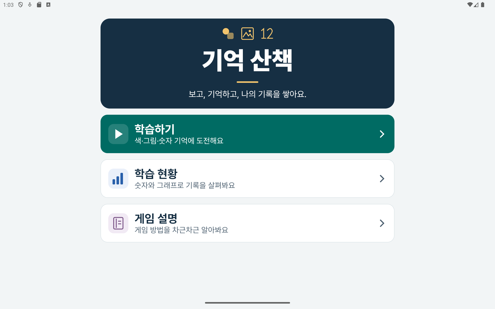
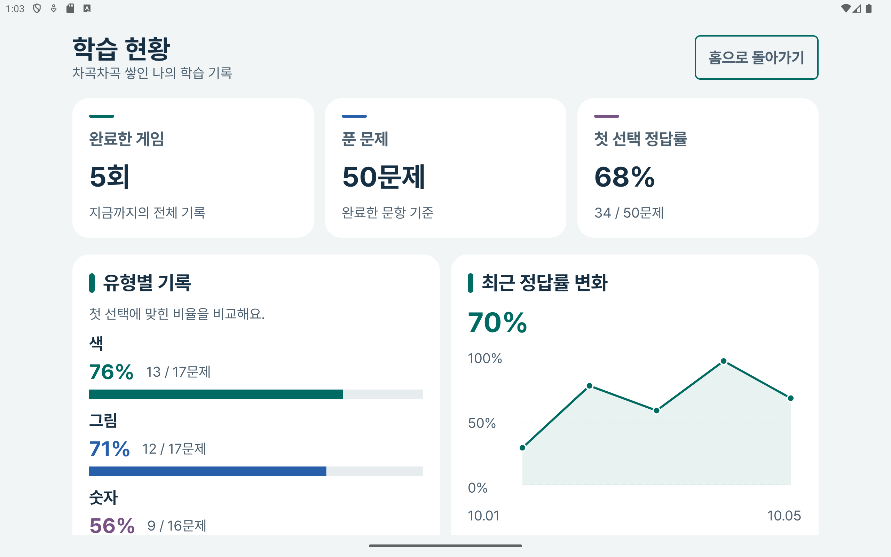
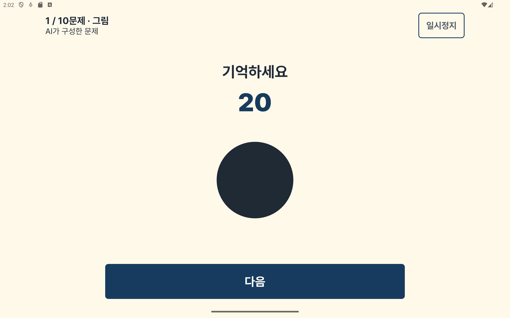

# 검증 보고서

대상: MemorySteps 0.4.0 · 2026-10-06 실제 모델 연결본 (`ba1ef86`). 개발 단계별 반복 기록을 최신 제출본 중심으로 정리한 문서이며, 아래 수치는 해당 구현에서 실행한 결과입니다. 문서 정리만으로 테스트를 다시 실행한 것은 아닙니다.

## 환경과 범위

- Windows 11, Corretto JDK 21, Gradle 8.14.4, AGP 8.13.2, Kotlin 2.2.21, Android SDK 36.
- 실행 검증: API 37 x86_64 에뮬레이터. 기본 화면 2560×1600px·320dpi·글자 100%.
- 작은 화면: 720×1600px·320dpi(360×800dp)·글자 200%. 확인 후 원래 화면 설정으로 복원했습니다.
- 계측 패키지는 `com.example.memorysteps.difficultyvalidation`으로 개인 플레이 앱과 분리했습니다. DB나 개인 기록을 Git/APK에 포함하지 않습니다.
- 실물 태블릿 성능과 시니어 사용성, TalkBack 전체 흐름은 미검증입니다.

## 최신 실행 결과

| 확인 | 결과 |
| --- | --- |
| 실제 가중치·네이티브 추론 | `NativeAuthorTest` 1개 통과. 모델로 10문제 출제, 정답 진행, 중간 저장 복원, 한 계획의 중복 소비 방지 |
| 첫 출제 시간 | 37,122ms. 내부 모델 복사 포함, 위 에뮬레이터 측정 |
| UI·마이그레이션 | 18개 통과. 실제 모델의 게임 시작→첫 정답 저장, 실패 시 기본 출제, 취소 시 게임 미생성, 10문제/연습/메뉴/기록, v1·v2·v3 기록 보존 |
| 작은 화면·글자 200% | 준비 실패/취소·16개 보기·1문제 연습 5개 통과 |
| JVM | 74개 통과. 게임 진행·난이도·밴딧·기록 지표·모델 재료/보기 수/중복/최근 대상 검증 |
| 일반 빌드 | 디버그 및 서명 전 릴리스 통과 |
| Lint | 오류 0, 기존 SDK/도구/라이브러리 버전 알림 14개 |
| APK | 모델 해시 일치, ARM64/x86_64 JNI·libc++ 및 폰트·모델·실행 엔진 고지 포함 |

일반 UI 회귀 테스트는 테스트용 출제기를 주입합니다. `NativeAuthorTest`와 `ActualAuthorUiTest`는 APK의 실제 모델을 사용합니다. 둘을 구분해 검증했습니다.

메뉴·그래프와 1문제 연습 변경 때에는 다음도 확인했습니다. 누적/유형별 수치는 저장 기록과 일치하고 빈 기록에 가짜 추이를 표시하지 않습니다. 합성 5게임의 34/50=68%와 추이 30·80·60·100·70%를 확인했으며 재생성 후 유지됐습니다. 세 유형 연습은 정답·기회 소진 뒤 학습 선택으로 돌아가고 성적 DB에 기록하지 않습니다. 정식 게임 도중 연습해도 기존 진행·난이도·성적을 보존합니다.

## 재현

고정 모델을 준비한 뒤 일반 앱과 단위 테스트를 빌드합니다. 로컬 SDK 경로와 JDK 설정은 [README](../README.md#실행)를 따릅니다.

```powershell
./tools/download_android_model.ps1
./gradlew.bat :app:testDebugUnitTest :app:assembleDebug :app:assembleRelease :app:lintDebug
```

아래는 격리 패키지에서 실제 모델·UI·마이그레이션을 실행하는 명령입니다. 테스트 시작 시 대상 기록을 초기화하므로 격리 설정을 유지합니다.

```powershell
./gradlew.bat -I tools/isolated-tests.init.gradle :app:connectedDebugAndroidTest '-Pandroid.testInstrumentationRunnerArguments.class=com.example.memorysteps.NativeAuthorTest,com.example.memorysteps.ActualAuthorUiTest,com.example.memorysteps.AuthorFailureUiTest,com.example.memorysteps.TrainingFlowTest,com.example.memorysteps.AdaptiveMigrationTest,com.example.memorysteps.NavigationSmokeTest,com.example.memorysteps.AdaptiveUiTest,com.example.memorysteps.RecordsDashboardTest'
```

검증 후 개인용 APK는 `-I` 없이 다시 빌드합니다. 한글 Windows 경로의 Gradle 8 테스트 인수 인코딩 문제를 피하기 위해 JDK 21과 `file.encoding=COMPAT`를 사용합니다. 소스는 UTF-8입니다.

- 일반 APK: `app/build/outputs/apk/debug/app-debug.apk`
- 빌드 보고서: `app/build/reports/`
- 로컬 로그: `.artifacts/native-author-test.log`, `author-ui-migration-tests.log`, `author-final-build.log`, `author-apk-verification.json`
- 개발 중 전체 로그·중간 캡처는 `.artifacts/`에만 보관합니다. 이전 단계의 검증 기록은 Git 이력에서 확인할 수 있습니다.

## 제출 파일

[0.4.0 릴리스](https://github.com/EndDefault/brain-walk/releases/tag/android-author-v0.4.0)의 `MemorySteps-AI-2026-10-06.apk`에 모델이 포함되어 있습니다.

- 디버그 APK: 670,416,559바이트. SHA-256 `5bdaaad006752f9dfe83d3cab32e1e883c7bc11c4539125059875fba8e9ac37e`
- 서명 전 릴리스 SHA-256: `634be421d21b06d7c542fb073723fd95857298c2f9790a9cb609b1d6a31dda76`
- 로컬 사본: `.artifacts/MemorySteps-AI-2026-10-06.apk`

## 대표 화면







[학습 선택](screenshots/submission-learn-tablet.png) · [게임 설명](screenshots/submission-guide-tablet.png) · [글자 200% 학습 선택](screenshots/submission-learn-largefont.png) · [글자 200% 그래프](screenshots/submission-trend-largefont.png)

학습 현황 캡처의 수치는 테스트용 합성 기록입니다. 대표 화면 7장만 Git에 유지합니다.

## 남은 검증

실물 태블릿의 속도·RAM, 모든 보기 수에서의 생성 성능, 실제 사용자의 맞춤 효과는 확인하지 않았습니다. 모델의 기존 약점 판단 정확도는 연결 작업으로 개선되지 않았으며 [모델 평가](QUESTION_MODEL_REPORT.md)에 한계를 남깁니다. 개인 최고 기록 기능은 미구현입니다.
